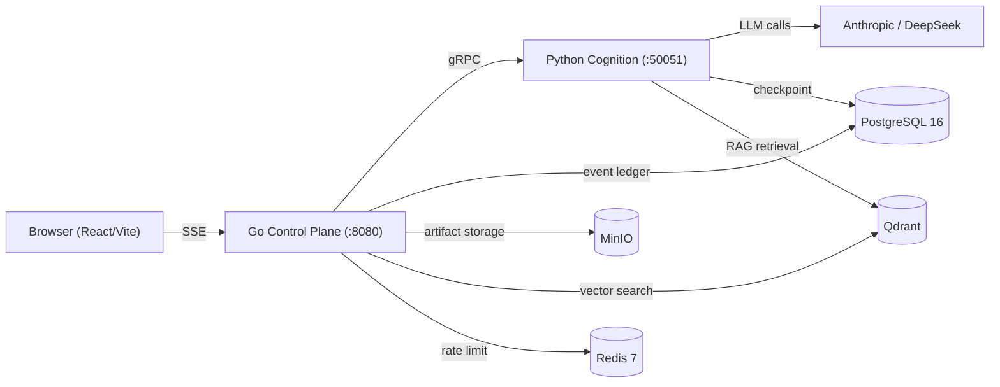

# Architecture

> [简体中文](ARCHITECTURE.zh-CN.md)

This is the **top-level architecture overview** for agent-go. It focuses on *why* the
system is built the way it is — the design decisions and their trade-offs — and links
to the detailed module documents under `eval/rag/corpus/`.

For "what it does and how to run it", see the [README](README.md).

## System overview

agent-go is a **dual-plane** multi-agent platform. A Go control plane owns the public
HTTP boundary and all the "plumbing"; a Python cognition plane runs the LLM agent graphs
and tools. They communicate over a single gRPC server-streaming RPC per run.

## Design decisions & trade-offs

### 1. Dual-plane split: Go for control, Python for cognition

- **Decision** — two processes with a protobuf contract between them; only the Go plane
  is reachable from the outside.
- **Why** — the control plane is I/O-bound (SSE fan-out, PostgreSQL writes, request
  routing); Go's goroutine scheduler is purpose-built for that. The cognition plane is
  LLM-bound (prompt construction, graph traversal, embeddings); Python owns the LLM
  ecosystem. Each plane can be optimized, scaled, and versioned independently.
- **Trade-off** — two processes to operate and a gRPC contract to maintain. The boundary
  is a real cost, but it is what keeps the external protocol and the agent graphs from
  being coupled.

### 2. gRPC server-streaming between planes (not REST)

- **Decision** — one long-lived server-streaming RPC per run; the cognition plane pushes
  typed `Event` messages via a `oneof` payload.
- **Why** — REST would force polling or a WebSocket upgrade for tool-execution events.
  gRPC gives a typed contract, zero polling, and natural streaming.
- **Trade-off** — harder to debug with a browser/curl than REST, and the `.proto` is a
  change-touchpoint for any event shape. Accepted because the event contract is central
  enough to deserve first-class typing.

### 3. Append-only event ledger, written before SSE push

- **Decision** — every event is written to PostgreSQL with a monotonic sequence number
  *before* it is pushed over SSE.
- **Why** — a disconnected client can replay from its last sequence and receive
  byte-identical output, the same principle as Kafka consumer offsets. This makes every
  run reproducible and auditable.
- **Trade-off** — every frame pays a database write before reaching the wire (write
  amplification), and the ledger grows unbounded. This is the price of replayability.

### 4. Hand-written ReAct loop (not `create_react_agent`)

- **Decision** — the ReAct graph is built from primitives (`StateGraph`, `ToolNode`,
  custom conditional edges) rather than LangGraph's `create_react_agent`.
- **Why** — the convenience helper hides the edge cases that matter in production: tool
  error recovery, step-limit enforcement at the graph level, and malformed tool output.
- **Trade-off** — more code to own and test. Accepted because those edge cases are
  exactly what a thin wrapper collapses under.

### 5. Three agent modes + role-based routing

- **Decision** — ReAct (fast think↔tools loop), Plan-Execute (decomposition with
  parallel executor fan-out via LangGraph Send API), and Deep Think (extended reasoning
  budgets).
- **Why** — different tasks have different latency/quality profiles; routing by mode (and
  by role internally) gives cost/quality control instead of one-size-fits-all.
- **Trade-off** — three execution paths to maintain and test; correctness of plan
  fan-out and checkpoint isolation is more subtle than a single loop.

### 6. Concurrency admission with backpressure

- **Decision** — a weighted semaphore caps in-flight runs (`MAX_CONCURRENT_RUNS`, default
  16); above the cap returns HTTP 429 with `Retry-After: 1`. A Redis rate limiter adds
  per-IP throttling (fail-open if Redis is down). Context cancellation propagates from
  browser disconnect through gRPC to the LLM call.
- **Why** — protects downstream systems (PostgreSQL, LLM APIs) from overcommit.
- **Trade-off** — bursts of legitimate traffic get rejected; the fail-open rate limiter
  means Redis outage degrades to "no rate limit" rather than "no service".

### 7. Prompt injection defense (three layers)

- **Decision** — input detection, prompt isolation (delimiters + hardened system prompt),
  and output filtering, modeled after OWASP Top 10 for LLM.
- **Why** — an agent that fetches web pages and runs tools has a larger injection surface
  than a chatbot.
- **Trade-off** — defense-in-depth adds latency and false-positive risk on both input and
  output; it is deliberately conservative on the security side.

### 8. Owner isolation by design

- **Decision** — every resource (run, session, artifact, KB document) is scoped to the
  authenticated user; enforced by middleware and a reverse-whitelist router.
- **Why** — multi-tenant data isolation must be a structural property, not per-endpoint
  `if` checks that new endpoints forget.
- **Trade-off** — the reverse-whitelist pattern means every new route must be explicitly
  allowed, which is friction but a fail-closed default.

### 9. Human-in-the-loop approvals

- **Decision** — protected tools require approval before execution, implemented with
  LangGraph interrupt/resume.
- **Why** — certain side effects (code execution, some tools) must not run autonomously.
- **Trade-off** — interrupt/resume complicates checkpoint/replay semantics and requires
  careful scope control on what a resumed run may do.

### 10. Agentic RAG (hybrid retrieval + fusion + rerank + reflect)

- **Decision** — dense vector + sparse BM25 hybrid retrieval, multi-query fusion with
  reciprocal rank merge (RRF), cross-encoder reranking, and a reflection loop.
- **Why** — hybrid retrieval covers both semantic and exact-match queries; reranking
  fixes the coarse first-stage ordering; reflection improves answer quality.
- **Trade-off** — a multi-stage pipeline is more to operate and tune than a single
  vector lookup, and each stage adds latency.

## Observability

- **Tracing** — OpenTelemetry across the Go↔Python boundary (see
  [`observability/otel_langfuse_grafana.md`](eval/rag/corpus/observability/otel_langfuse_grafana.md)).
- **Metrics** — 13+ Prometheus metrics (see
  [`observability/prometheus_metrics.md`](eval/rag/corpus/observability/prometheus_metrics.md)).
- **LLM observability** — optional Langfuse integration.

## Detailed documents

The in-depth, per-module architecture documents live under `eval/rag/corpus/`. They are
the source of truth for each subsystem:

| Area | Documents |
|------|-----------|
| Architecture | [`dual_plane_system`](eval/rag/corpus/architecture/dual_plane_system.md), [`event_contract_ledger_replay`](eval/rag/corpus/architecture/event_contract_ledger_replay.md) |
| Control plane | [`grpc_sse_streaming`](eval/rag/corpus/control-plane/grpc_sse_streaming.md), [`http_api_auth_rbac`](eval/rag/corpus/control-plane/http_api_auth_rbac.md), [`schedules_github_connectors`](eval/rag/corpus/control-plane/schedules_github_connectors.md) |
| Orchestration | [`react_graph`](eval/rag/corpus/orchestration/react_graph.md), [`plan_execute_replan`](eval/rag/corpus/orchestration/plan_execute_replan.md), [`run_admission_cancellation`](eval/rag/corpus/orchestration/run_admission_cancellation.md), [`send_fanout_concurrency`](eval/rag/corpus/orchestration/send_fanout_concurrency.md) |
| HITL | [`approval_interrupt_resume`](eval/rag/corpus/hitl/approval_interrupt_resume.md), [`approval_scope_replay_limits`](eval/rag/corpus/hitl/approval_scope_replay_limits.md) |
| Persistence | [`postgres_business_and_events`](eval/rag/corpus/persistence/postgres_business_and_events.md), [`langgraph_checkpoint_memory_fork`](eval/rag/corpus/persistence/langgraph_checkpoint_memory_fork.md), [`minio_artifacts_attachments`](eval/rag/corpus/persistence/minio_artifacts_attachments.md) |
| Retrieval | [`agentic_rag_graph`](eval/rag/corpus/retrieval/agentic_rag_graph.md), [`dense_sparse_rrf`](eval/rag/corpus/retrieval/dense_sparse_rrf.md), [`rerank_citations_providers`](eval/rag/corpus/retrieval/rerank_citations_providers.md), [`query_rewrite_reflect`](eval/rag/corpus/retrieval/query_rewrite_reflect.md) |
| Tools | [`unified_registry`](eval/rag/corpus/tools/unified_registry.md), [`mcp_transports_lifecycle`](eval/rag/corpus/tools/mcp_transports_lifecycle.md), [`skill_disclosure_runner`](eval/rag/corpus/tools/skill_disclosure_runner.md), [`code_interpreter_sandbox_boundary`](eval/rag/corpus/tools/code_interpreter_sandbox_boundary.md) |
| Deployment | [`docker_config_infrastructure`](eval/rag/corpus/deployment/docker_config_infrastructure.md) |
| Observability | [`otel_langfuse_grafana`](eval/rag/corpus/observability/otel_langfuse_grafana.md), [`prometheus_metrics`](eval/rag/corpus/observability/prometheus_metrics.md) |
| Troubleshooting | [`failure_modes_known_limits`](eval/rag/corpus/troubleshooting/failure_modes_known_limits.md) |
