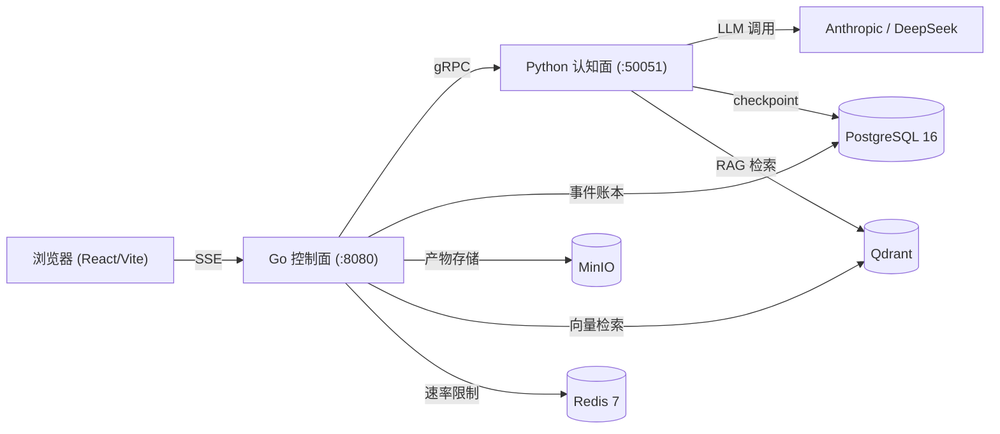

# 架构设计

> [English](ARCHITECTURE.md)

本文是 agent-go 的顶层架构总览，重点讲清楚系统「为什么这样建」——每条设计决策背后的取舍——并给出 `eval/rag/corpus/` 下各模块详细文档的入口。

想了解「它是什么、怎么跑起来」，请看 [README](README.md)。

## 系统概览

agent-go 是一个双平面多智能体平台。Go 控制面是唯一的对外入口，负责 HTTP、鉴权、事件账本这些「管道」；Python 认知面负责跑 LLM 智能体图和工具。两者之间靠每个 run 一条 gRPC server-streaming 长连接通信。

## 设计决策与取舍

### 1. 双平面拆分：Go 管控制，Python 管认知

- **决策**：拆成两个进程，用 protobuf 契约衔接；对外只暴露 Go 平面。
- **为什么**：控制面是 I/O 密集型（SSE 扇出、PostgreSQL 写入、请求路由），Go 的 goroutine 调度器正好擅长；认知面是 LLM 密集型（prompt 构造、图遍历、embedding），Python 有最全的 LLM 生态。两个平面各自演进、各自扩容。
- **取舍**：要同时运维两个进程，还要维护 gRPC 契约。这是实打实的成本，但换来了外部协议与智能体图的解耦。

### 2. 两个平面之间用 gRPC server-streaming，而不是 REST

- **决策**：每个 run 一条长连接 server-streaming RPC，认知面用 `oneof` 载荷推送带类型的 `Event` 消息。
- **为什么**：用 REST 的话，工具执行事件要么靠轮询、要么升级成 WebSocket。gRPC 有类型化契约、不用轮询、天生就是流式的。
- **取舍**：gRPC 不如 REST 方便用浏览器或 curl 直接调试，而且事件结构一变就得改 `.proto`。能接受，是因为事件契约足够核心，值得用强类型来约束。

### 3. append-only 事件账本：先落库，再推 SSE

- **决策**：每个事件在推上 SSE 之前，先带单调递增序号写进 PostgreSQL。
- **为什么**：断线的客户端可以从上次序号回放，拿到的输出和实时流字节级一致，原理跟 Kafka 的 consumer offset 一样。这样每个 run 都可复现、可审计。
- **取舍**：每一帧在推给客户端之前都要先写一次数据库（写放大），账本也会无限增长。这就是可回放要付的代价。

### 4. 手写 ReAct 循环，不用 `create_react_agent`

- **决策**：用原语（`StateGraph`、`ToolNode`、自定义条件边）手写 ReAct 图，而不是直接调 LangGraph 的 `create_react_agent`。
- **为什么**：那个便捷封装会把生产里最要命的边缘情况藏起来——工具报错怎么恢复、步数限制怎么在图层面兜住、工具返回畸形输出怎么办。
- **取舍**：要自己写、自己测更多代码。能接受，是因为薄封装恰恰会在这些边缘情况上崩。

### 5. 三种 Agent 模式 + 按角色路由

- **决策**：ReAct（快速的 think↔tools 循环）、Plan-Execute（拆解任务，通过 LangGraph Send API 并行扇出多个执行器）、Deep Think（加长推理预算）。
- **为什么**：不同任务对延迟和质量的诉求不一样；按模式（内部再按角色）路由，就能在成本和效果之间做选择，而不是一刀切。
- **取舍**：三条执行路径都要维护和测试；plan 扇出和 checkpoint 隔离的正确性，比单循环更容易踩坑。

### 6. 并发准入与背压

- **决策**：加权信号量封顶并发中的 run 数（`MAX_CONCURRENT_RUNS`，默认 16），超了就返回 HTTP 429 + `Retry-After: 1`。Redis 限流器再做一层按 IP 节流（Redis 挂了就 fail-open）。context 取消会从浏览器断连一路传到 gRPC，再到 LLM 调用。
- **为什么**：保护下游（PostgreSQL、LLM API）不被超额请求压垮。
- **取舍**：流量突发时会有合法请求被拒；fail-open 意味着 Redis 故障时退化成「不限流」，而不是「不服务」。

### 7. 防 Prompt 注入（三层）

- **决策**：输入检测、prompt 隔离（分隔符 + 加固系统提示）、输出过滤，参照 OWASP Top 10 for LLM。
- **为什么**：一个会抓网页、跑工具的 Agent，注入面比聊天机器人大得多。
- **取舍**：纵深防御会加延迟、有误报风险；安全侧刻意做得保守。

### 8. 默认按 owner 隔离

- **决策**：每个资源（run、session、artifact、KB 文档）都绑定到认证用户，靠中间件和反向白名单路由强制。
- **为什么**：多租户的数据隔离必须是结构性的，不能靠每个端点各写一个 `if`——那样新端点迟早漏。
- **取舍**：反向白名单意味着每加一条路由都得显式放行，有点麻烦，但默认就是 fail-closed。

### 9. 人工审批（HITL）

- **决策**：受保护的工具执行前要审批，用 LangGraph 的 interrupt/resume 实现。
- **为什么**：有些副作用（跑代码、部分工具）不能让它自主执行。
- **取舍**：interrupt/resume 让 checkpoint 和回放语义更复杂；恢复后的 run 能做什么，也得严格划定边界。

### 10. Agentic RAG：混合检索 + 融合 + 重排 + 反思

- **决策**：稠密向量 + 稀疏 BM25 混合检索、多查询融合 + RRF、cross-encoder 重排、再加一轮反思。
- **为什么**：混合检索能同时覆盖语义查询和精确匹配；重排修正第一阶段的粗排序；反思提升最终答案质量。
- **取舍**：多级流水线比一次向量查询更难运维、更难调参，每一级还都加延迟。

## 可观测性

- **追踪**：OpenTelemetry 跨 Go↔Python 边界（见 [`observability/otel_langfuse_grafana.md`](eval/rag/corpus/observability/otel_langfuse_grafana.md)）。
- **指标**：13+ 个 Prometheus 指标（见 [`observability/prometheus_metrics.md`](eval/rag/corpus/observability/prometheus_metrics.md)）。
- **LLM 可观测**：可选接入 Langfuse。

## 详细文档

各模块的深入架构文档都在 `eval/rag/corpus/` 下，是每个子系统的权威说明：

| 领域 | 文档 |
|------|------|
| 架构 | [`dual_plane_system`](eval/rag/corpus/architecture/dual_plane_system.md)、[`event_contract_ledger_replay`](eval/rag/corpus/architecture/event_contract_ledger_replay.md) |
| 控制面 | [`grpc_sse_streaming`](eval/rag/corpus/control-plane/grpc_sse_streaming.md)、[`http_api_auth_rbac`](eval/rag/corpus/control-plane/http_api_auth_rbac.md)、[`schedules_github_connectors`](eval/rag/corpus/control-plane/schedules_github_connectors.md) |
| 编排 | [`react_graph`](eval/rag/corpus/orchestration/react_graph.md)、[`plan_execute_replan`](eval/rag/corpus/orchestration/plan_execute_replan.md)、[`run_admission_cancellation`](eval/rag/corpus/orchestration/run_admission_cancellation.md)、[`send_fanout_concurrency`](eval/rag/corpus/orchestration/send_fanout_concurrency.md) |
| HITL | [`approval_interrupt_resume`](eval/rag/corpus/hitl/approval_interrupt_resume.md)、[`approval_scope_replay_limits`](eval/rag/corpus/hitl/approval_scope_replay_limits.md) |
| 持久化 | [`postgres_business_and_events`](eval/rag/corpus/persistence/postgres_business_and_events.md)、[`langgraph_checkpoint_memory_fork`](eval/rag/corpus/persistence/langgraph_checkpoint_memory_fork.md)、[`minio_artifacts_attachments`](eval/rag/corpus/persistence/minio_artifacts_attachments.md) |
| 检索 | [`agentic_rag_graph`](eval/rag/corpus/retrieval/agentic_rag_graph.md)、[`dense_sparse_rrf`](eval/rag/corpus/retrieval/dense_sparse_rrf.md)、[`rerank_citations_providers`](eval/rag/corpus/retrieval/rerank_citations_providers.md)、[`query_rewrite_reflect`](eval/rag/corpus/retrieval/query_rewrite_reflect.md) |
| 工具 | [`unified_registry`](eval/rag/corpus/tools/unified_registry.md)、[`mcp_transports_lifecycle`](eval/rag/corpus/tools/mcp_transports_lifecycle.md)、[`skill_disclosure_runner`](eval/rag/corpus/tools/skill_disclosure_runner.md)、[`code_interpreter_sandbox_boundary`](eval/rag/corpus/tools/code_interpreter_sandbox_boundary.md) |
| 部署 | [`docker_config_infrastructure`](eval/rag/corpus/deployment/docker_config_infrastructure.md) |
| 可观测性 | [`otel_langfuse_grafana`](eval/rag/corpus/observability/otel_langfuse_grafana.md)、[`prometheus_metrics`](eval/rag/corpus/observability/prometheus_metrics.md) |
| 排障 | [`failure_modes_known_limits`](eval/rag/corpus/troubleshooting/failure_modes_known_limits.md) |
