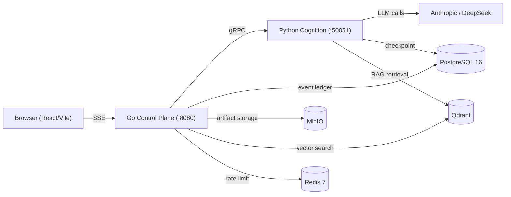

# Agent-go

[](https://github.com/LingMi1/agent-go/actions/workflows/pr.yml)
[](https://go.dev/)
[](https://python.org/)
[](LICENSE)

> [简体中文](README.zh-CN.md)

**A production-grade multi-agent platform built from the ground up.** Not a thin wrapper around LangChain — every layer is hand-engineered: from the protobuf contract and gRPC transport, to the ReAct execution loop and append-only event ledger.

---

## Why this exists

Most "AI Agent" projects are thin wrappers over `create_react_agent()` — they work for a demo but collapse under edge cases. I wanted to understand what a **truly production-ready** multi-agent system needs:

- How do you push streaming events reliably without dropping frames?
- How do you handle tool execution failures inside an agent loop?
- How do you isolate user data in a multi-tenant system?
- How do you make every run replayable for debugging and audit?

This project is my answer to those questions.

---

## Architecture



- **Go Control Plane** — HTTP/SSE streaming, authentication (bcrypt + Bearer tokens), run dispatch with concurrency control, append-only event ledger, artifact proxy, gRPC circuit breaker
- **Python Cognition Plane** — LangGraph-based agent graphs (ReAct, Plan-Execute, Deep Research), tool execution, Agentic RAG pipeline, MCP integration, skill system
- **The bridge** — gRPC with server-streaming. The control plane opens a single RPC per run; cognition streams typed `Event` messages back. A `gobreaker` circuit breaker prevents cascading failures.

---

## Features

### Agent Modes
- **ReAct (Quick)** — think ↔ tools loop with custom step limiting and tool error isolation. Intentionally hand-written instead of using `create_react_agent` to control every edge case.
- **Plan-Execute (Deep Research)** — multi-step task decomposition with parallel executor branches via LangGraph Send API fan-out. Each branch runs independently with its own checkpoint.
- **Deep Think** — extended reasoning with configurable step budgets.

### Core Platform
- **Event ledger** — All execution events are appended to PostgreSQL *before* SSE push. Every run is replayable — send `GET /runs/{id}/events?after={N}` and get byte-identical output to the real-time stream.
- **Multi-user auth** — Registration/login with bcrypt password hashing, Bearer tokens (30-day TTL), admin role, reverse-whitelist route protection, owner isolation on all resources (runs, sessions, artifacts, KB).
- **Session forking** — Fork from any completed run to explore alternative paths. Checkpoint seeding preserves the conversation context in the new branch.
- **HITL approvals** — Human-in-the-loop via LangGraph interrupt/resume. Protected tools require approval before execution.
- **Knowledge base** — Upload documents, auto-chunk, embed, and search via Qdrant hybrid retrieval. User-scoped with server-side identity binding.

### Agentic RAG
- Dense vector + sparse BM25 hybrid retrieval
- Multi-query fusion with reciprocal rank merging
- Cross-encoder reranking
- Reflection loop for answer quality improvement

### Tools & Integrations
- **MCP** (Model Context Protocol) — Server registry with three transports: stdio, SSE, streamable HTTP
- **Skills** — Progressive disclosure system that scans `SKILL.md` files. Scripts run locally or in Docker sandbox
- **Web search** — Multi-provider chain (Tavily → Bing → Baidu → DuckDuckGo)
- **Web fetch** — SSRF-protected page fetching
- **Image generation** — Multi-provider (OpenAI, Volcano Ark, Tongyi Wanxiang)
- **Code interpreter** — Python sandbox execution (disabled by default; requires explicit enable + Docker runner)

### Observability
- OpenTelemetry distributed tracing across Go ↔ Python boundary
- 13+ Prometheus metrics (`myagent_runs_in_flight`, `myagent_run_duration_seconds`, `myagent_sse_frames_pumped`, etc.)
- Grafana dashboard with overview panel
- Langfuse LLM observability (optional)

### Proactive Automation
- GitHub connector with PAT-based polling
- Cron-based scheduled runs
- Event trigger rules with template-based prompt rendering

---

## Demo

| Chat | Admin Panel |
|------|-------------|
|  |  |

---

## Tech Stack

| Layer | Technology |
|-------|-----------|
| Frontend | React 19, TypeScript, Tailwind CSS v4, Vite, shadcn/ui |
| Control Plane | Go 1.25, Chi router, pgx, gRPC, Prometheus, OpenTelemetry |
| Cognition Plane | Python 3.12, LangGraph, LangChain, gRPC |
| Infrastructure | PostgreSQL 16, Qdrant, MinIO, Redis 7 |
| Containerization | Docker Compose, multi-stage Dockerfiles |

---

## Quick Start

### What you need

- Docker Desktop (with Docker Compose v2)
- (Optional) A DeepSeek or Anthropic API key for real LLM runs

### 1. Launch (no API key required)

```bash
cd deploy
cp .env.example .env
docker compose --profile app up -d --build
```

The default configuration uses **fake models** — no API key needed. Open **http://localhost:8080**, sign up with any username/password (min 6 chars), and start a conversation.

### 2. With a real LLM

Edit `deploy/.env`:

```env
DEEPSEEK_API_KEY=sk-your-key
COGNITION_FAKE_MODEL=0
```

Then `docker compose --profile app up -d --build` again.

### 3. Development mode

```bash
# Terminal 1: infrastructure
make infra-up

# Terminal 2: control plane (Go, :8080)
make control

# Terminal 3: cognition (Python, :50051)
make cognition

# Terminal 4: frontend (React, :5173)
cd web && npm run dev
```

---

## Project Structure

```
├── control-plane/           # Go: HTTP/SSE, gRPC client, auth, dispatch
│   ├── cmd/                # Entry point
│   ├── internal/
│   │   ├── api/            # HTTP endpoints (auth, runs, sessions, KB, admin)
│   │   ├── artifact/       # Artifact workspace + MinIO proxy
│   │   ├── cognition/      # gRPC client + gobreaker circuit breaker
│   │   ├── config/         # Environment-based configuration
│   │   ├── connector/      # GitHub connector + template matching
│   │   ├── dispatch/       # Run orchestration + semaphore admission
│   │   ├── event/          # Event envelope, SSE framing, sequence validation
│   │   ├── health/         # Concurrent health check aggregation
│   │   ├── kb/             # Direct Qdrant management (list/delete)
│   │   ├── metrics/        # Prometheus metrics
│   │   ├── middleware/     # HTTP middleware (rate limit, request ID)
│   │   ├── observability/  # OpenTelemetry seam
│   │   ├── poller/         # Background connector polling
│   │   ├── scheduler/      # Cron-based scheduled runs
│   │   ├── secret/         # AES-256-GCM encryption for secrets
│   │   ├── store/          # PostgreSQL repos (runs, sessions, users, etc.)
│   │   └── stream/         # SSE hub (gRPC → SSE pump)
├── cognition/               # Python: LangGraph graphs, tools, RAG
│   ├── cognition/
│   │   ├── graphs/         # ReAct, Plan-Execute, guard modules
│   │   ├── tools/          # Web search, image gen, report, calculator
│   │   ├── rag/            # Chunking, hybrid retrieval, fusion, rerank
│   │   ├── mcp/            # MCP server registry (stdio/sse/streamable HTTP)
│   │   ├── skills/         # Skill system (SKILL.md scanning, sandbox runner)
│   │   └── providers/      # LLM adapters (Anthropic, DeepSeek, fake)
├── web/                     # React frontend
│   └── src/
│       ├── components/    # UI components (shadcn/ui + AdminPanel, Sidebar, etc.)
│       ├── hooks/          # useAuth, useRunStream, useHealth
│       ├── lib/            # SSE parser, API client, state reducer
│       └── views/          # ChatView, LoginView
├── proto/                   # Protocol Buffers (buf managed)
├── deploy/                  # Docker Compose, Dockerfiles, env templates
└── .github/workflows/       # CI/CD: lint + test on PR
```

---

## Testing

**490+ tests across Go, Python, and TypeScript, all passing in CI.**

```bash
# Go — all tests run with -race detector
cd control-plane && go test -race -count=1 ./...

# Python
cd cognition && uv run pytest -q

# Full check (Go + Python + TypeScript)
make check
```

The CI pipeline (`.github/workflows/pr.yml`) runs on every PR:
- `go vet` + `go test -race -count=1`
- `ruff` + `pytest`
- `tsc --noEmit` + `npm run test`
- Docker image builds (control-plane + cognition)

All checks must pass before merging.

---

## Key Design Decisions

### 1. Event ledger before SSE push
Every event is written to PostgreSQL with a monotonic sequence number *before* it hits the SSE wire. Reconnect after a disconnect, and the client replays from the last known sequence — the output is byte-identical to what would have been streamed live. Same principle as Kafka consumer offsets.

### 2. Why gRPC between planes (not REST)
A REST approach would require polling or WebSocket upgrade for streaming tool execution events. With gRPC server-streaming, the cognition plane pushes typed `Event` messages to the control plane over a single long-lived RPC per run. Clean contract, zero polling, typed payloads via `oneof`.

### 3. Why Go for control, Python for cognition
The control plane is I/O-bound (SSE fan-out, PostgreSQL writes, request routing) — Go's goroutine scheduler is purpose-built for this. The cognition plane is LLM-bound (prompt construction, graph traversal, embedding calls) — Python has the entire LLM ecosystem. The gRPC contract isolates the two worlds so each plane can be optimized independently.

### 4. Hand-written ReAct (not `create_react_agent`)
LangGraph's `create_react_agent` abstracts away the think↔tools loop, but it hides critical edge cases: tool error recovery, step limit enforcement at the graph level, and what happens when a tool returns malformed output. I built the ReAct graph from primitives (`StateGraph`, `ToolNode`, custom conditional edges) so every decision point is explicit and testable.

### 5. Concurrency admission with backpressure
A weighted semaphore caps in-flight runs (`MAX_CONCURRENT_RUNS`, default 16). Requests above the cap receive an immediate HTTP 429 with `Retry-After: 1`, protecting downstream (PostgreSQL, LLM APIs) from overcommit. A Redis-based rate limiter adds an independent layer of per-IP throttling at the HTTP middleware level (fail-open if Redis is unavailable). Context cancellation propagates from browser disconnect all the way through gRPC to the cognition plane's LLM call.

### 6. Prompt injection defense (three layers)
Modeled after OWASP Top 10 for LLM: (1) input detection — classify suspicious patterns before they reach the LLM, (2) prompt isolation — wrap user input with delimiters and system prompt hardening, (3) output filtering — scan the model's response for leaked system instructions before returning to the user.

### 7. Owner isolation by design
Every resource (run, session, artifact, knowledge base document) is scoped to the authenticated user ID. The API layer enforces this via middleware, not per-endpoint if-checks. New endpoints are automatically protected by the reverse-whitelist router pattern.

---

## License

[MIT](LICENSE)
