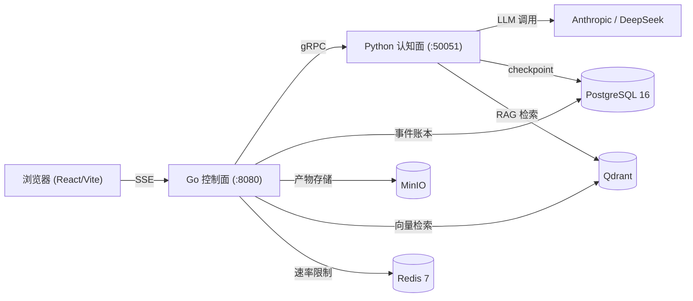
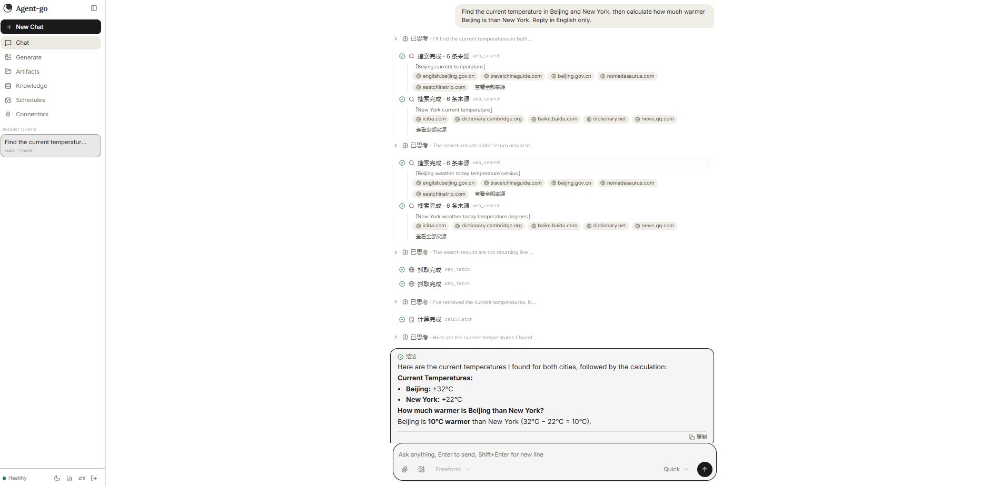
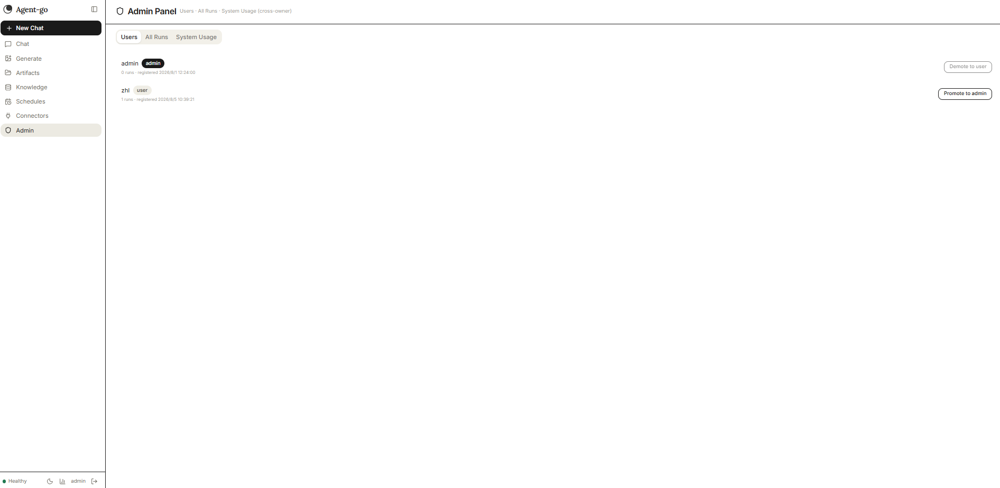

# Agent-go

[](https://github.com/LingMi1/agent-go/actions/workflows/pr.yml)
[](https://go.dev/)
[](https://python.org/)
[](LICENSE)

**从零构建的生产级多智能体平台。** 不是对 LangChain 的薄封装——从 protobuf 协议定义到 gRPC 通信、从 ReAct 执行循环到 append-only 事件账本，每一层都是手写的。

---

## 为什么做这个项目

市面上大多数 "AI Agent" 项目只是对 `create_react_agent()` 的薄封装——跑个 demo 还行，遇到边缘情况就崩。我想搞清楚一个**真正能上生产**的多智能体系统到底需要什么：

- 怎么保证流式事件推送不丢帧？
- 工具调用失败后 Agent 怎么恢复？
- 多用户场景下数据怎么隔离？
- 每轮对话怎么做到可回放、可审计？

这个项目就是我对这些问题的回答。

---

## 架构



- **Go 控制面** — HTTP/SSE 流式推送、认证（bcrypt + Bearer token）、Run 调度与并发控制、事件账本、产物代理、gRPC 熔断
- **Python 认知面** — LangGraph 智能体图（ReAct、Plan-Execute、Deep Research）、工具执行、RAG 检索链路、MCP 集成、技能系统
- **桥梁** — gRPC server-streaming。控制面每次 Run 发起一个 gRPC 长连接，认知面持续推送带类型的 Event 消息。gobreaker 熔断器防止级联故障。

---

## 功能特性

### Agent 模式
- **ReAct（快速）** — think ↔ tools 循环，自定义步数限制和工具异常隔离。故意不用 `create_react_agent`，手写了每个决策点以确保对边缘情况的完全控制。
- **Plan-Execute（深度研究）** — 多步任务自动拆解，通过 LangGraph Send API 并行 fan-out 执行器分支。每个分支独立运行、独立 checkpoint。
- **Deep Think** — 扩展推理，可配置步数预算。

### 核心平台
- **事件账本** — 所有事件先写入 PostgreSQL 再通过 SSE 推送。每次 run 可完整回放——发 `GET /runs/{id}/events?after={N}` 即可获取与实时流字节一致的输出。
- **多用户认证** — 注册/登录（bcrypt 密码哈希）、Bearer token（30 天有效期）、管理员角色、反向白名单路由保护、所有资源的 owner 隔离。
- **会话 Fork** — 从任意已完成的 run fork 出新分支探索替代路径，checkpoint 注入保留对话上下文。
- **人工审批 (HITL)** — 基于 LangGraph interrupt/resume，受保护的工具需审批后才能执行。
- **知识库** — 上传文档自动分块、嵌入、通过 Qdrant 混合检索，按用户隔离。

### Agentic RAG
- Dense 向量 + BM25 稀疏混合检索
- 多查询融合 + 倒数排名合并
- Cross-encoder 重排序
- 反思循环提升答案质量

### 工具与集成
- **MCP**（Model Context Protocol）— 三传输协议服务注册：stdio / SSE / streamable HTTP
- **技能系统** — 渐进式披露，扫描 `SKILL.md` 文件，支持本地或 Docker 沙箱执行
- **网络搜索** — 多 provider 链路（Tavily → Bing → Baidu → DuckDuckGo）
- **网页抓取** — SSRF 防护
- **图像生成** — 多 provider（OpenAI / 火山方舟 / 通义万相）
- **代码解释器** — Python 沙箱执行（默认禁用，需显式开启 + Docker runner）

### 可观测性
- OpenTelemetry 全链路追踪，跨 Go ↔ Python 传播
- 13+ Prometheus 指标
- Grafana 仪表盘
- Langfuse LLM 可观测（可选）

### 主动自动化
- GitHub 连接器（PAT 轮询）
- Cron 定时 Run
- 事件触发规则 + 模板化 Prompt

---

## Demo

| 对话 | 管理后台 |
|------|---------|
|  |  |

---

## 技术栈

| 层 | 技术 |
|-------|-----------|
| 前端 | React 19、TypeScript、Tailwind CSS v4、Vite、shadcn/ui |
| 控制面 | Go 1.25、Chi router、pgx、gRPC、Prometheus、OpenTelemetry |
| 认知面 | Python 3.12、LangGraph、LangChain、gRPC |
| 基础设施 | PostgreSQL 16、Qdrant、MinIO、Redis 7 |
| 容器化 | Docker Compose、多阶段 Dockerfile |

---

## 快速开始

### 你需要

- Docker Desktop（含 Docker Compose v2）
- （可选）DeepSeek 或 Anthropic API Key 用于真实 LLM 运行

### 1. 启动（无需 API Key）

```bash
cd deploy
cp .env.example .env
docker compose --profile app up -d --build
```

默认配置使用**假模型**——无需 API Key。打开 **http://localhost:8080**，用任意用户名/密码注册登录（密码至少 6 位），即可开始对话。

### 2. 使用真实 LLM

编辑 `deploy/.env`：

```env
DEEPSEEK_API_KEY=sk-your-key
COGNITION_FAKE_MODEL=0
```

然后重新执行 `docker compose --profile app up -d --build`。

### 3. 开发模式

```bash
# 终端 1：基础设施
make infra-up

# 终端 2：控制面 (Go, :8080)
make control

# 终端 3：认知面 (Python, :50051)
make cognition

# 终端 4：前端 (React, :5173)
cd web && npm run dev
```

---

## 项目结构

```
├── control-plane/           # Go：HTTP/SSE、gRPC 客户端、鉴权、调度
│   ├── cmd/                # 入口
│   ├── internal/
│   │   ├── api/            # HTTP 端点（auth、runs、sessions、KB、admin）
│   │   ├── artifact/       # 产物工作区 + MinIO 代理
│   │   ├── cognition/      # gRPC 客户端 + gobreaker 熔断器
│   │   ├── config/         # 环境变量配置
│   │   ├── connector/      # GitHub 连接器 + 模板匹配
│   │   ├── dispatch/       # Run 编排 + 信号量准入
│   │   ├── event/          # 事件封装、SSE 帧、序列号校验
│   │   ├── health/         # 并发健康检查聚合
│   │   ├── kb/             # 直接 Qdrant 管理（list/delete）
│   │   ├── metrics/        # Prometheus 指标
│   │   ├── middleware/     # HTTP 中间件（限流、请求 ID）
│   │   ├── observability/  # OpenTelemetry seam
│   │   ├── poller/         # 后台连接器轮询
│   │   ├── scheduler/      # Cron 定时 Run
│   │   ├── secret/         # AES-256-GCM 密钥加密
│   │   ├── store/          # PostgreSQL 数据访问层
│   │   └── stream/         # SSE hub（gRPC → SSE 泵）
├── cognition/               # Python：LangGraph 图、工具、RAG
│   ├── cognition/
│   │   ├── graphs/         # ReAct、Plan-Execute、安全防护
│   │   ├── tools/          # 网络搜索、生图、报告、计算器
│   │   ├── rag/            # 分块、混合检索、融合、重排序
│   │   ├── mcp/            # MCP 服务注册（stdio/sse/streamable HTTP）
│   │   ├── skills/         # 技能系统（SKILL.md 扫描、沙箱执行）
│   │   └── providers/      # LLM 适配（Anthropic、DeepSeek、fake）
├── web/                     # React 前端
│   └── src/
│       ├── components/     # UI 组件（基于 shadcn/ui）
│       ├── hooks/          # useAuth、useRunStream、useHealth
│       ├── lib/            # SSE 解析器、API 客户端、状态归并器
│       └── views/          # ChatView、LoginView、AdminView
├── proto/                   # Protocol Buffers（buf 管理）
├── deploy/                  # Docker Compose、Dockerfile、环境变量模板
└── .github/workflows/       # CI/CD：PR 时自动 lint + test
```

---

## 测试

**Go + Python 共 530+ 测试用例，CI 全部通过。**

```bash
# Go — 所有测试带 race detector
cd control-plane && go test -race -count=1 ./...

# Python
cd cognition && uv run pytest -q

# 全量检查（Go + Python + TypeScript）
make check
```

CI pipeline（`.github/workflows/pr.yml`）每次 PR 自动执行：
- `go vet` + `go test -race -count=1`
- `ruff` + `pytest`
- `tsc --noEmit` + `npm run test`

全部通过才允许合并。

---

## 关键设计决策

### 1. 事件先落库再推送
所有事件带单调递增序列号写入 PostgreSQL，再通过 SSE 推送。断线重连后从已知序列号回放，输出与实时流字节一致。——和 Kafka consumer offset 同一种思路。

### 2. 为什么用 gRPC 连接两个面（而不是 REST）
REST 方案需要轮询或 WebSocket 升级才能传输流式工具事件。gRPC server-streaming 让认知面通过单个长连接持续推送带类型的 Event 消息到控制面。清晰的契约，零轮询，`oneof` 保证类型安全。

### 3. 为什么 Go 做控制面、Python 做认知面
控制面是 I/O 密集型（SSE 扇出、PostgreSQL 写入、请求路由）——Go 的 goroutine 调度器就是为这个设计的。认知面是 LLM 密集型（prompt 构造、图遍历、embedding 调用）——整个 LLM 生态都在 Python。gRPC 协议隔离两个世界，各自可以独立优化。

### 4. 手写 ReAct（不用 `create_react_agent`）
LangGraph 的 `create_react_agent` 封装了 think↔tools 循环，但隐藏了关键边缘情况：工具异常恢复、图级别的步数限制、工具返回异常输出时的处理。我用原始组件（StateGraph、ToolNode、自定义条件边）构建 ReAct 图，每个决策点都是显式的、可测试的。

### 5. 并发准入与背压控制
加权信号量限制并行 run 数量（`MAX_CONCURRENT_RUNS`，默认 16）。超限请求立即返回 HTTP 429 并附带 `Retry-After: 1`，保护下游（PostgreSQL、LLM API）免于过载。基于 Redis 的 HTTP 限流中间件提供独立的 per-IP 频率控制（Redis 不可用时自动降级放行）。Context 取消从浏览器断连一路传播到认知面的 LLM 调用。

### 6. Prompt 注入三层防御
对标 OWASP Top 10 for LLM：（1）输入检测——识别可疑模式后再进入 LLM，（2）提示词隔离——用户输入加分隔符 + 系统提示词加固，（3）输出过滤——扫描模型回复中是否泄露了系统指令。

### 7. Owner 隔离设计
所有资源（run、session、artifact、知识库文档）按认证用户 ID 隔离。API 层通过中间件统一强制，不是每个端点写 if 判断。新端点通过反向白名单路由模式自动受保护。

---

## License

[MIT](LICENSE)
